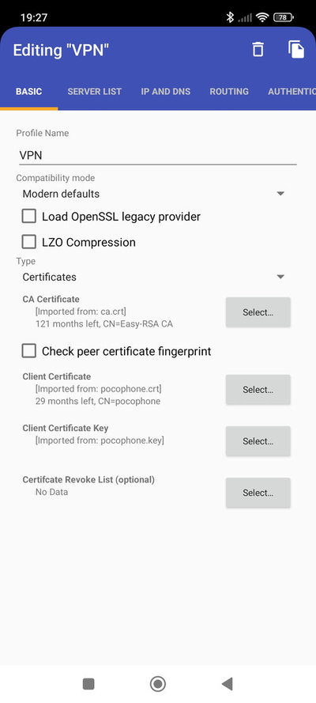
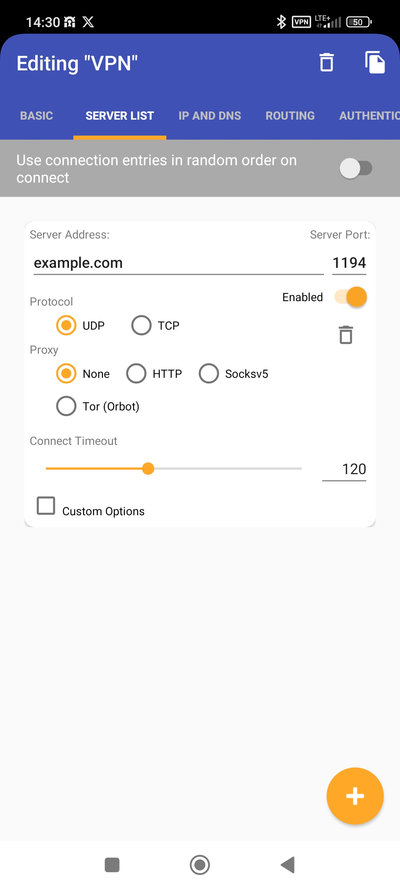
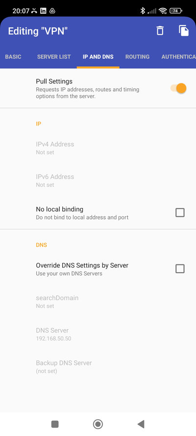
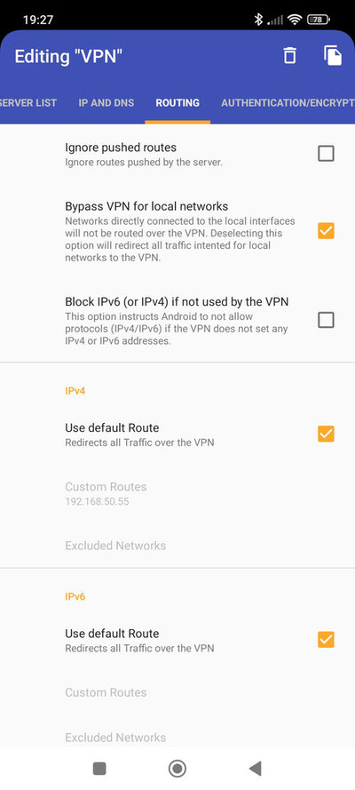
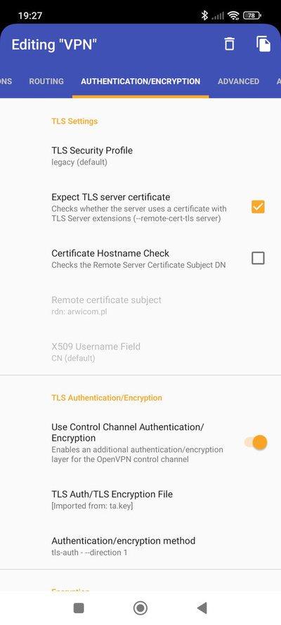
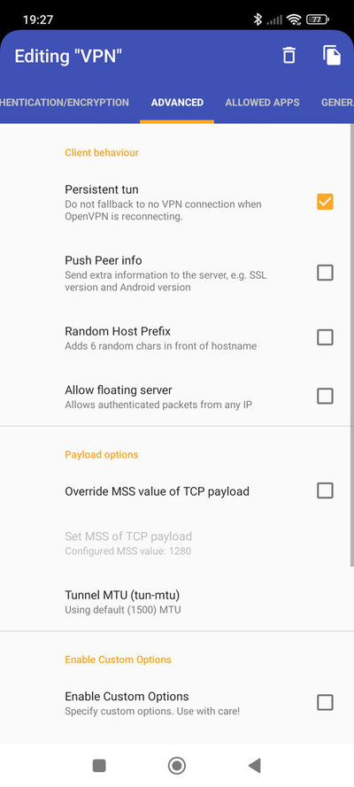

# OpenVPN Docker Container

A quick method to run an **OpenVPN server** inside your home network using **Docker**.
It is designed for home setups or small business networks.
The configuration is minimal, easy to understand, and simple to extend.

With this setup, you can securely connect to your home network from outside.
It also includes monitoring provided by **ruimarinho**’s OpenVPN Monitor.

This is one of the **simplest ways to run a private VPN** at home.

## Requirements

- Installed **Docker** and **Docker Compose** on your host system.
- OpenVPN client application (PC, Mac, Linux, or mobile).
- A firewall rule to open **UDP port 1194** (or another port if reconfigured).
- IP forwarding enabled on the host system.

## Mapped Directories

- **config**
  Contains two configuration files:
  - `server.conf` – OpenVPN server configuration file loaded into the container at startup.
  - `client.ovpn` – Example Windows client configuration.

- **client**
  Generated client keys will be stored here for download.
  For security, client keys should be deleted from this location after they are copied to the client device.

- **openvpn-logs**
  Directory with OpenVPN logs for convenient access and troubleshooting.

## Firewall / Port Forwarding

- If running behind a home router, forward `1194/udp` to your host system’s LAN IP.
- Ensure **UDP port 1194** is allowed through your host’s firewall.
- The OpenVPN port can also be customized in the `.env` file with `VPN_PORT`.

## Server setup Instructions

Example VPN Environment:

```
              I N T E R N E T
                     │
    ┌────────────────┴────────────────┐
    │========== Home Router ==========│
    │         Port forwarding         │
    │  1194/udp -> 192.168.50.50:1194 │
    └────────────────┬────────────────┘
    ┌────────────────┴────────────────┐
    │========== Docker Host ==========│
    │      IP:  192.168.50.50         │
    │      LAN: 192.168.50.0/24       │
    │      Opened ports:              │
    │          - 1194/udp             │
    │          - 5555/tcp             │
    └────────────────┬────────────────┘
    ┌────────────────┴────────────────┐
    │ OpenVPN Container (10.8.0.0/24) │
    └─────────────────────────────────┘
```
The setup was tested on **Ubuntu 24.04.3 LTS**.

1. Install **Docker** and **Docker Compose** on your host system.

2. Clone the repository:
   ```bash
   git clone https://github.com/Artyum/OpenVPN.git
   ```

3. Copy `.env_example` to `.env` and adjust variables as needed.

4. Edit `server.conf` and configure DNS servers:
   ```conf
   push "dhcp-option DNS 1.1.1.1"
   push "dhcp-option DNS 1.0.0.1"
   ```

5. Open the required firewall ports on your host:
   - `1194/udp` (VPN traffic)
   - `5555/tcp` (management port for monitoring)

6. Start the stack:
   ```bash
   docker compose up -d
   ```

7. Access the monitoring interface at:
   `http://<host-ip>:11940`

✅ You now have a minimal OpenVPN setup with monitoring in your home network.

## Generating Keys for VPN Clients
> **Note:** Run these commands from the **Docker host**, not from inside the container.

### Adding keys for devices or users, e.g.:
```bash
docker exec -it openvpn-server /bin/bash -c "/usr/share/scripts/client.sh add adam"
docker exec -it openvpn-server /bin/bash -c "/usr/share/scripts/client.sh add cellphone"
```
This script will also generate the client certificate and key, which will be required later when configuring the client.

### Revoking keys and blocking VPN access
```bash
docker exec -it openvpn-server /bin/bash -c "/usr/share/scripts/client.sh revoke <name>"
```

⚠️ **Important:** After revoking a client key, the VPN server must be restarted:
```bash
docker restart openvpn-server
```

## Client Setup Instructions

OpenVPN Client Installation and Configuration (Windows)

1. **Install the OpenVPN client for Windows**

   Download and install the application from the official OpenVPN website https://openvpn.net/community.

2. **Generate client keys**

   Use the server-side scripts to create a key pair and configuration for the user/device.

3. **Copy configuration files to the directory**

   Place them in the following path: `C:\Users\<username>\OpenVPN\config`

   Required files:
   - `<user>.crt`
   - `<user>.key`
   - `ca.crt`
   - `ta.key`
   - `client.ovpn`

   > All of these files can be found in the **client** directory generated by the script.

4. **Edit the `client.ovpn` file**

   Adjust file names and paths to match your keys:
   ```conf
   remote example.com 1194
   ca ca.crt
   cert adam.crt
   key adam.key
   tls-auth ta.key 1
   ```

   If the keys are stored in a different directory than the .ovpn file, you must provide the full path, e.g.:
   ```conf
   cert C:\\Users\\<username>\\OpenVPN\\keys\\adam.crt
   ```

5. **Start VPN connection**

   Launch the **OpenVPN GUI**, right-click the tray icon, and connect. The software should use the `client.ovpn` profile.

## OpenVPN for Android

You can configure a VPN connection directly on your mobile phone. The example below uses **OpenVPN for Android** created by Arne Schwabe, available on Google Play.

### 1. Basic
Configure the client certificates:
- **CA Certificate**
- **Client Certificate**
- **Client Certificate Key**

### 2. Server List
- Set the **Server Address** (your public IP or dynamic DNS hostname).

### 3. Routing
- Set `Use default Route` under IPv4 to redirect all Traffic over the VPN.

### 4. Authentication
- Specify the **TLS Auth / TLS Encryption file**.
- **Encryption ciphers**: `AES-256-GCM` or `CHACHA20-POLY1305` for smartphone
- **Packet authentication**: `SHA256`

  
  

## OpenVPN Monitor

This setup includes an **OpenVPN Monitor** container, providing a simple web interface to view connected clients and server status. Access the monitor at `http://<host-ip>:11940`.
